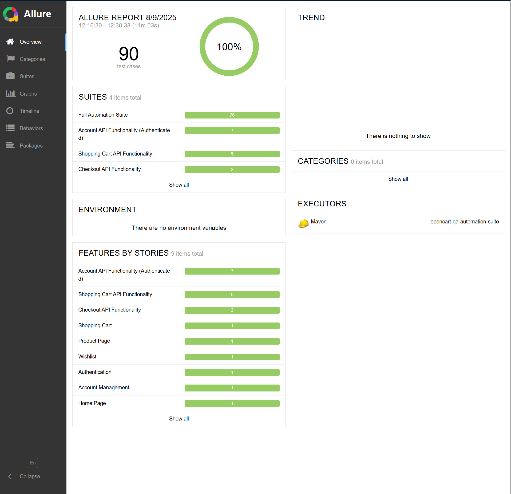

# OpenCart QA Automation Suite


UI + API automation for the **OpenCart** demo site.  
Runs locally or on **Selenium Grid (Docker)** and publishes **Allure** reports in **GitHub Actions**.

---

## 🔗 Target Under Test
- Site: [OpenCart Demo](https://tutorialsninja.com/demo/)
- Base URL: `https://tutorialsninja.com/demo`
> For demo/learning purposes only. Not affiliated with OpenCart.

---

## ⚙️ Tech Stack
- **UI:** Java · Selenium · TestNG · Page Object Model · Parallel execution
- **API:** Cucumber (BDD) · RestAssured (guest + authenticated flows)
- **Infra:** Selenium Grid (Docker) – Chrome & Firefox nodes
- **CI/CD:** GitHub Actions (Grid spun up via `docker compose`)
- **Reporting:** Allure (results + HTML report artifacts)

---

## ✅ What You Get
- 100% green full suite (UI + API) in CI
- Cross-browser runs on Grid (Chrome + Firefox in parallel)
- Clean logs & deterministic API assertions (handles redirects)
- Allure results + HTML report uploaded on every CI run

---

## 🧪 How to Run

### Prerequisites
- JDK **21**
- Maven **3.9+**
- Docker Desktop / Docker Engine
- (Optional) Allure CLI for local viewing

### Local run (no Grid)
```bash
mvn clean test -Dmode=local -DsuiteXmlFile=src/test/resources/testng/full-suite.xml
```

### Run on Selenium Grid (Docker, locally)
```bash
docker compose -f docker-compose.yml up -d
# Grid UI: http://localhost:4444/ui

mvn clean test -Dmode=grid -DsuiteXmlFile=src/test/resources/testng/full-suite.xml
```

### Stop Grid
```bash
docker compose -f docker-compose.yml down -v
```

---

## 🧵 Test Suites

### UI (TestNG)
Parallel across Chrome and Firefox (two `<test>` blocks in `testng.xml`)

Example:
```bash
# Only UI tests (by TestNG groups)
mvn test -Dmode=grid -Dgroups=ui -DsuiteXmlFile=src/test/resources/testng/full-suite.xml
```

### API (Cucumber)
- Feature files in `src/test/resources/features`
- Runner: `com.opencart.api.runners.CucumberTestRunner`

```bash
# Filter by tag
mvn test -Dmode=grid -Dcucumber.filter.tags="@api" -DsuiteXmlFile=src/test/resources/testng/full-suite.xml
```

---

## 📊 Allure Reporting

- **Results:** `target/allure-results`
- **HTML:** `target/site/allure-maven-plugin`

### Generate (Maven):
```bash
mvn io.qameta.allure:allure-maven:report -Dallure.results.directory=target/allure-results
```

### View locally (CLI):
```bash
allure serve target/allure-results
```

> **Note:** If `index.html` shows "Loading…", serve it via HTTP (e.g., `python -m http.server 8080`) or use `allure serve`.

### Allure report (sample)


---

## 🧰 CI (GitHub Actions)

The workflow:

1. Checkout code
2. Set up Java & cache Maven deps
3. Start Selenium Grid via `docker compose`
4. Run UI + API tests with `-Dmode=grid`
5. Generate Allure report
6. Upload `allure-results` & `allure-report` artifacts

**Key snippet:**
```yaml
- name: 🐳 Start Selenium Grid from docker-compose.yml
  run: |
    docker compose -f docker-compose.yml up -d
    echo "Waiting for Selenium Grid to be ready..."
    for i in {1..30}; do
      if curl -sf http://localhost:4444/wd/hub/status | grep -q '"ready":true'; then
        echo "Grid is ready"; break
      fi
      sleep 2
    done

- name: 🧪 Run UI + API Tests (Full Suite on Grid)
  env:
    CHROME_OPTS: "--headless --no-sandbox --disable-dev-shm-usage"
  run: mvn clean test -Dmode=grid -DsuiteXmlFile=src/test/resources/testng/full-suite.xml
```

---

## 🔧 Configuration Notes

**Driver modes:**
- `-Dmode=local` → local Chrome/Firefox (WebDriverManager)
- `-Dmode=grid` → RemoteWebDriver to **GRID_URL** (auto-detected):
    - Jenkins: `http://selenium-hub:4444/wd/hub`
    - Local / GitHub Actions: `http://localhost:4444/wd/hub`

**Headless in CI:** set `CHROME_OPTS="--headless --no-sandbox --disable-dev-shm-usage"`

**API redirects:** validated with `.redirects().follow(false)` for consistent 200/302 checks

**Session isolation:** SessionManager resets cookies per scenario; hooks avoid double-logout

---

## 📝 License

MIT © 2025 Saparbek-4